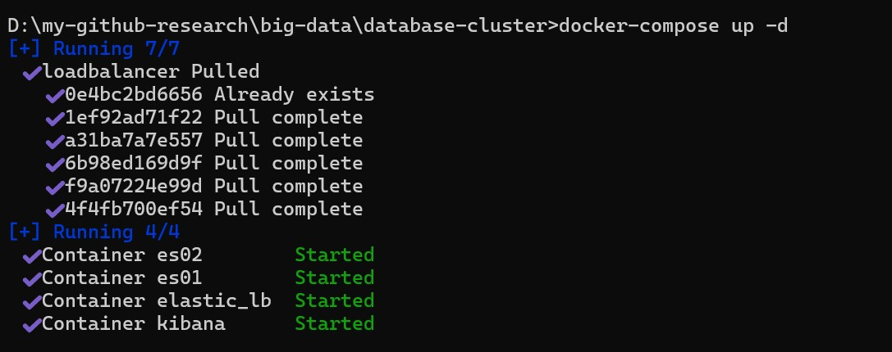
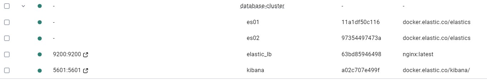
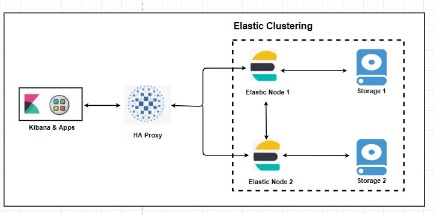
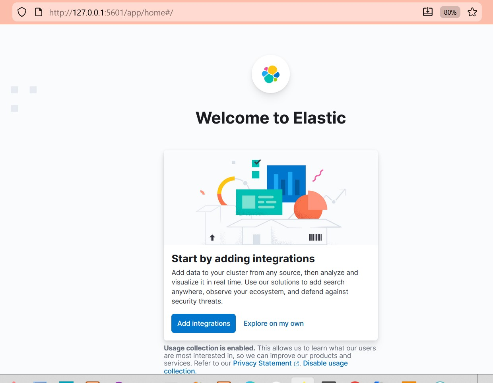
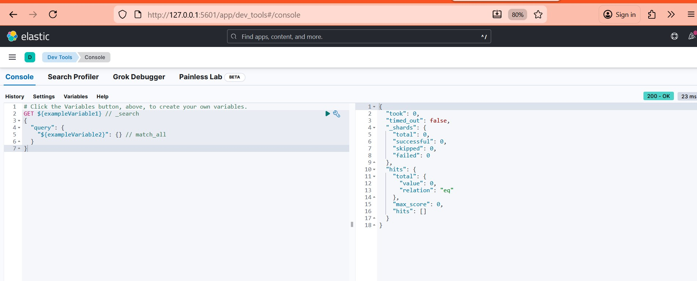
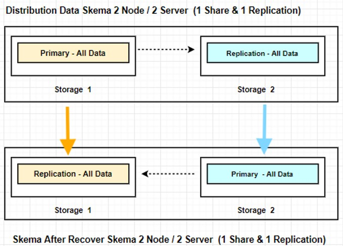
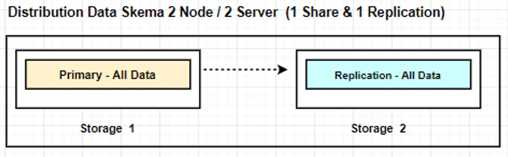
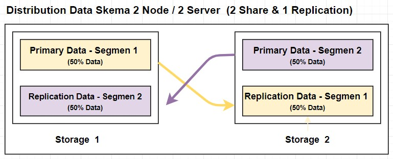
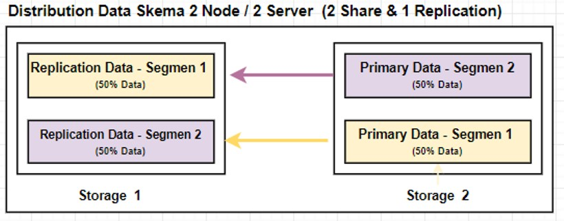

# Database Cluster

Database clustering is a technique to group several database servers into one unit that works together to improve availability, scalability, and reliability. With clustering, data can be distributed and replicated automatically between nodes, so if one node fails, other nodes can still serve requests without interruption.

Sharding and Replication are two fundamental pillars in modern distributed database architecture that complement each other to achieve high scalability and data availability.

Sharding focuses on splitting data horizontally, breaking large datasets into several servers to distribute write load and storage.

Replication focuses on copying the same data from one server to another to ensure fault tolerance, high availability, and handling read load balancing.

In this project, we use a distributed database with Elastic.
Elastic (Elasticsearch) is a popular distributed search and analytics engine for storing, searching, and analyzing large amounts of data in real-time. Elastic is used for log management, data analysis, full-text search, and observability.


## Table of Content

- [Database Cluster](#database-cluster)
	- [Table of Content](#table-of-content)
	- [1. Deployment Method using](#1-deployment-method-using)
	- [2. Architectur Elastic Cluster](#2-architectur-elastic-cluster)
		- [2.1. Kibana \& Apps (User Layer)](#21-kibana--apps-user-layer)
		- [2.2. HAProxy (Load Balancer)](#22-haproxy-load-balancer)
		- [2.3. Elastic Clustering (Core Layer)](#23-elastic-clustering-core-layer)
		- [2.4. Storage 1 \& Storage 2 (Data Layer)](#24-storage-1--storage-2-data-layer)
	- [3. Level Penerapan Sharding](#3-level-penerapan-sharding)
	- [4. Distribution Data Scheme 2 Node / 2 Server  (1 Share \& 1 Replication)](#4-distribution-data-scheme-2-node--2-server--1-share--1-replication)
		- [4.1 Distribusi Data Write \& Read (Load Balance)](#41-distribusi-data-write--read-load-balance)
		- [4.2  Auto Fail Over](#42--auto-fail-over)
		- [4.3  Cara Setting Index Shard dan Replication di Elastic](#43--cara-setting-index-shard-dan-replication-di-elastic)
	- [5. Distribution Data Scheme: 2 Node / 2 Server  (2 Share \& 1 Replication)](#5-distribution-data-scheme-2-node--2-server--2-share--1-replication)
		- [5.1 Distribusi Data Write \& Read (Load Balance)](#51-distribusi-data-write--read-load-balance)
		- [5.2  Auto Fail Over](#52--auto-fail-over)
		- [5.3  Skema After Recover](#53--skema-after-recover)
		- [5.4 Cara Setting Index Shard dan Replication di Elastic](#54-cara-setting-index-shard-dan-replication-di-elastic)
		- [5.5  Cara Reroute](#55--cara-reroute)
	- [6. Data Distribution Scheme: 3 Nodes / 3 Servers (3 Shards \& 1 Replication)](#6-data-distribution-scheme-3-nodes--3-servers-3-shards--1-replication)
	- [7. Check Shard and Replica Settings on Index](#7-check-shard-and-replica-settings-on-index)
	- [8. Check Distribution](#8-check-distribution)
	- [9. Important: Cannot Change the Number of Shards](#9-important-cannot-change-the-number-of-shards)
	- [10. API for Adding, Editing, Viewing, Deleting, Searching](#10-api-for-adding-editing-viewing-deleting-searching)
		- [10.1 Add Data (Create Document)](#101-add-data-create-document)
		- [10.2 Edit Data (Update Document)](#102-edit-data-update-document)
		- [10.3 View Data (Get Document)](#103-view-data-get-document)
		- [10.4 Delete Data (Delete Document)](#104-delete-data-delete-document)
		- [10.5 Search Data (Find Documents)](#105-search-data-find-documents)


## 1. Deployment Method using

The deployment is executed using the docker-compose command:

```
docker-compose up -d
```


--




## 2. Architectur Elastic Cluster 




Below are the details of the workflow and its components:

### 2.1. Kibana & Apps (User Layer)





Kibana is the data visualization interface running on top of Elasticsearch. It is used to create dashboards, graphs, and visualizations of the data stored in Elastic, facilitating data analysis and monitoring.

This layer consists of the interfaces and applications that interact with the data:
  Kibana: Used for data visualization, dashboard creation, and managing Elasticsearch indices.
 Apps: Refers to third-party or custom applications that submit queries to retrieve or insert data into the system.

### 2.2. HAProxy (Load Balancer)

HAProxy is a software load balancer and proxy used to efficiently distribute traffic to multiple backend servers.
 Role: Acts as a Single Entry Point (gateway).
 Main Task: Receives requests from Kibana/Apps and distributes them evenly across the nodes in the Elasticsearch cluster.
 Advantage: Provides high availability. If an Elasticsearch node fails, HAProxy automatically redirects traffic to the active nodes, ensuring continuous service for users.

### 2.3. Elastic Clustering (Core Layer)

This is the core of the architecture, comprising two or more interconnected nodes:
  Elastic Node 1 & Node 2: Elasticsearch servers handling search and data storage services. They communicate to synchronize cluster status and ensure data replication.
  Dashed Box: Indicates that these nodes form a single logical unit called a Cluster.

### 2.4. Storage 1 & Storage 2 (Data Layer)
Each node has its own storage media. In a proper cluster configuration, data is typically replicated (copied) across storage units. If Storage 1 fails, the data is safe because a copy exists in Storage 2, accessible via Node 2.

## 3. Level Penerapan Sharding 

Sharding is typically implemented at the table level.
    Table Level (Most Common): Divides rows of a very large table and distributes them across multiple storage units.
    Goal: Increases write scalability and reduces the I/O load on any single server.

## 4. Distribution Data Scheme 2 Node / 2 Server  (1 Share & 1 Replication)




### 4.1 Distribusi Data Write & Read (Load Balance)

Read Scaling: The Load Balancer directs read requests (SELECT) to both Storage 1 and Storage 2 nodes.

Write Distribution: Write requests are always directed to the active Primary on Storage 1, which is then replicated to Storage 2.


### 4.2  Auto Fail Over  
If the Primary fails or is inaccessible (Storage 1), the system can automatically failover to the Replica instance (which is automatically promoted to Primary), ensuring data remains accessible without interruption.



 
### 4.3  Cara Setting Index Shard dan Replication di Elastic

To create an index with 1 shard and 1 replica:

```
PUT /data_product
{
	"settings": {
		"index": {
			"number_of_shards": 1,
			"number_of_replicas": 1
		}
	}
}
```

## 5. Distribution Data Scheme: 2 Node / 2 Server  (2 Share & 1 Replication)



### 5.1 Distribusi Data Write & Read (Load Balance)
Read Scaling: The Load Balancer directs read requests (SELECT) to all nodes (Storage 1 and Storage 2).

Write Distribution: Write distribution is split:
    50% goes to the Primary on Storage 1 (segment 1 data).
    50% goes to the Primary on Storage 2 (segment 2 data).
    Goal: To enhance load balancing and make read scaling lighter and faster.
Replication is performed by cross-storing the data between Segment 1 and Segment 2.  

### 5.2  Auto Fail Over  
If the Primary on Storage 1 fails, the system can automatically failover to Storage 2 (and the Replica which is automatically promoted to Primary), ensuring data access.

### 5.3  Skema After Recover 
After the Storage 1 node is repaired, Storage 1 will hold all replicas, and Storage 2 will hold all primaries.


 
### 5.4 Cara Setting Index Shard dan Replication di Elastic

To create an index with 2 shards and 1 replica:

```
PUT /data_product
{
	"settings": {
		"index": {
			"number_of_shards": 2,
			"number_of_replicas": 1
		}
	}
}
```

### 5.5  Cara Reroute 	

Reroute in Elasticsearch is the process of moving or allocating shards (primary and replica copies of your data) between the nodes in a cluster, which facilitates Automatic Rebalancing to ensure data and workload are evenly distributed across all active data nodes for optimal load balancing and performance.

```

POST /_cluster/reroute?retry_failed=true

```

You do not need to explicitly mention the index name whose routing you want to affect when using the POST /_cluster/reroute command for automatic rebalancing or unassigned shard allocation.


## 6. Data Distribution Scheme: 3 Nodes / 3 Servers (3 Shards & 1 Replication)

Read Scaling: The Load Balancer directs read requests (SELECT) to all nodes (Storage 1, Storage 2, and Storage 3).

Write Distribution: Write distribution is split into three:
    1/3 of the data goes to the Primary on Storage 1 (segment 1).
    1/3 goes to the Primary on Storage 2 (segment 2).
    1/3 goes to the Primary on Storage 3 (segment 3).
    Goal: To increase load balancing and make read scaling lighter and faster.
Replication is performed by cross-storing the data among Segment 1, Segment 2, and Segment 3.


## 7. Check Shard and Replica Settings on Index

```
GET /data_product/_settings
```

## 8. Check Distribution

Untuk melihat distribusi shard dan replica di cluster:
```
GET /_cat/shards?v
```

## 9. Important: Cannot Change the Number of Shards
If you need to change the number of primary shards (e.g., from 1 to 2 or vice-versa), you must use the Reindexing process. The most common and flexible step is to use Reindexing (creating a new index, then moving all the old data into the new index).

## 10. API for Adding, Editing, Viewing, Deleting, Searching

### 10.1 Add Data (Create Document)

```
POST /data_product/_doc
{
  "name": "Sample Product",
  "price": 100,
  "category": "Electronics"
}
```

### 10.2 Edit Data (Update Document)

```
POST /data_product/_update/<document_id>
{
  "doc": {
    "price": 120
  }
}
```

### 10.3 View Data (Get Document)
```
GET /data_product/_doc/<document_id>
```

### 10.4 Delete Data (Delete Document)

```
DELETE /data_product/_doc/<document_id>
```

### 10.5 Search Data (Find Documents)

```
GET /data_product/_search
{
  "query": {
    "match": {
      "name": "Sample"
    }
  }
}
```